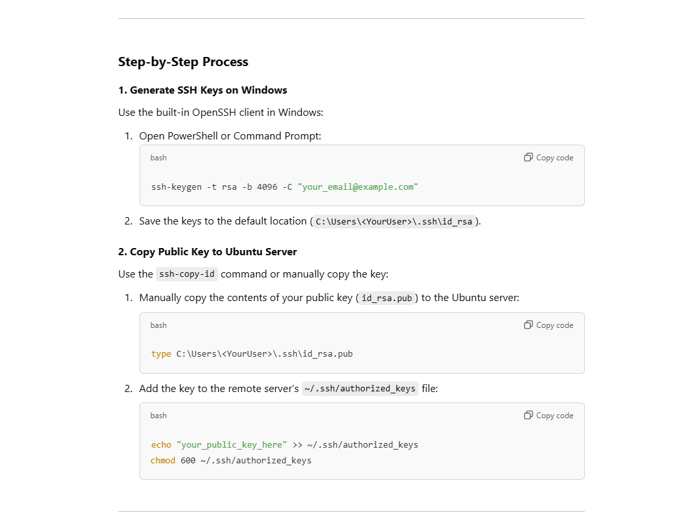
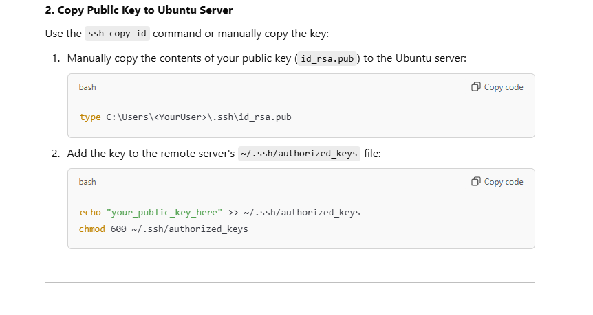
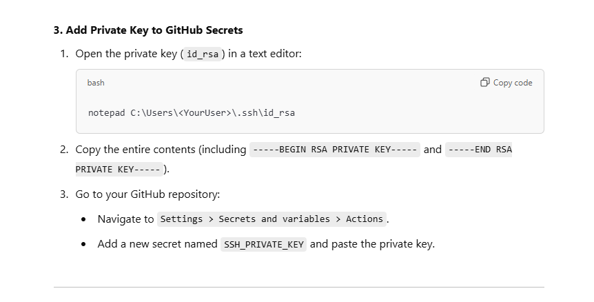
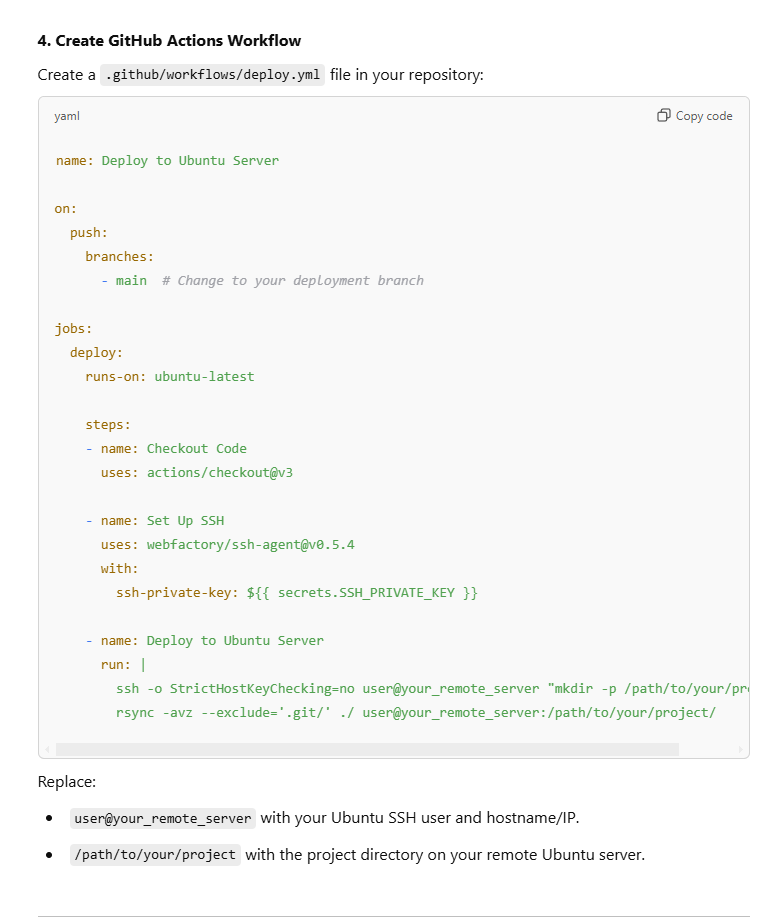
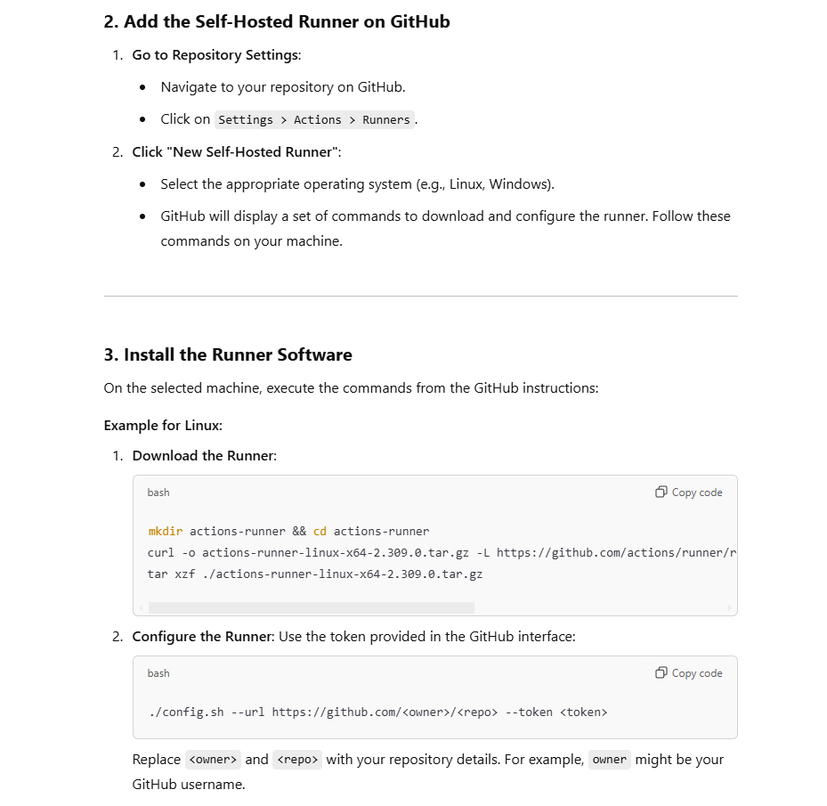
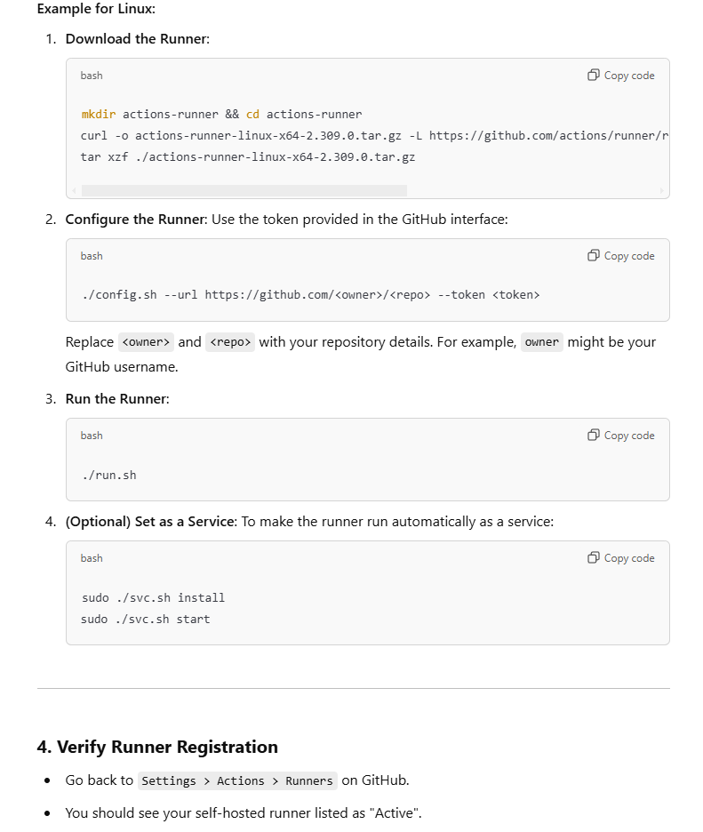

# How to upload code to github then server:

{width="6.5in" height="4.913194444444445in"}

[On your local windows machine]{.mark}

1.  ssh-keygen -t rsa -b 4096 -C <your_email@example.com>

2.  search using program 'everything' for '.pub' program

[On ubuntu machine accept the windows ssh key to make connection between
two on ssh]{.mark}

{width="6.5in" height="3.4611111111111112in"}

[On GitHub, on your repository u freshly created]{.mark}

{width="6.5in" height="3.3027777777777776in"}

[On your current project, create the following yml file before pushing
code to repository]{.mark}

{width="6.5in" height="7.749305555555556in"}

[Now you must upload code to GitHub using git add ., git push]{.mark}

[Now u have multiple choices, if the machine (ubuntu server on remote
server) is protected by a firewall or proxy or VPN, you have two
choices:]{.mark}

1.  make a GitHub runner instance run locally on the end machine (ubuntu
    server located in Europe), this way, GitHub runner is talking
    directly from inside the machine as listener to events from global
    GitHub

    a.  u can set the yml file to a place on the network on another
        machine currently on network with the ubuntu server existing,
        and u need to setup the configuration as in the figure above of
        '.yml' file

name: Deploy to Ubuntu Server

on:

  push:

    branches:

      - main  # Change to your deployment branch

jobs:

  deploy:

    runs-on: self-hosted

    steps:

    - name: Checkout Code

      uses: actions/checkout@v3

    - name: Set Up SSH

      uses: webfactory/ssh-agent@v0.5.4

      with:

        ssh-private-key: \${{ secrets.GLPR }}

    - name: Deploy to Ubuntu Server

      run: \|

        ssh -o StrictHostKeyChecking=no glpi@192.168.151.22 \"mkdir -p
/home/glpi/glpi_react\"

        rsync -avz \--exclude=\'.git/\' ./
glpi@192.168.151.22:/home/glpi/glpi_react

b.  u can set the GitHub runner in the same server as the ubuntu machine
    holding the code, this way you need to modify the '.yml' file, [U DO
    NOT NEED SSH HERE, it is direct]{.mark}, you can simplify the GitHub
    Actions workflow since no SSH or rsync is required. Instead, you can
    directly execute commands on the machine itself.

name: Deploy to Local Server

on:

  push:

    branches:

      - main  # Replace with the branch you want to deploy from

jobs:

  deploy:

    runs-on: self-hosted  # Use the self-hosted runner on the same
machine

    steps:

    - name: Checkout Code

      uses: actions/checkout@v3

    - name: Deploy Application

      run: \|

        mkdir -p /home/glpi/glpi_react

        rsync -avz \--exclude=\'.git/\' ./ /home/glpi/glpi_react/

U should also register a GitHub runner in github account

{width="5.441476377952756in"
height="5.300788495188102in"}

https://github.com/repository_owner/repository_name/settings/actions/runners/new?arch=x64&os=linux

{width="6.5in" height="7.691666666666666in"}

[Still need to make the runner as a service]{.mark} , using the optional
command in the picture above, after navigating to the directory
containing the runner directory that is installed on ubuntu

NOW, it will run on machine boot, so it is always running

2.  The other choice is to use public ip, provided by the admin of
    company and allow a specific port to access ssh for this specific
    machine, so its kinda gateway,in ssh, u need to include the -P
    command or other way , search for it

# How to perform docker compose delete container and image and create new one when a new release is perform using git tag/release
----------------------------
1-must make docker non sudo
sudo groupadd docker
sudo usermod -aG docker $USER
newgrp docker
sudo systemctl restart docker
restart ubuntu remote machine

this is needed to not encounter sock error 
sudo chmod 666 /var/run/docker.sock
--------------------------------

name: Deploy on Tag with Image Retention (Self-Hosted Runner)

on:

  push:

    tags:

      - \'\[0-9\]\*.\[0-9\]\*\' \# Matches tags like 0.1, 1.2, etc.

jobs:

  deploy:

    runs-on: self-hosted

    steps:

      - name: Checkout code

        uses: actions/checkout@v3

      - name: Deploy application

        run: \|

          IMAGE_NAME=glpi-react-img

          CONTAINER_NAME=glpi-react-container

         

          \# Stop and remove the old container

          docker ps -a -q \--filter \"name=\$CONTAINER_NAME\" \| xargs
-r docker rm -f

          \# Remove older images beyond the retention limit (keep 3
older + current)

          docker images \$IMAGE_NAME \--format
\"{{.Repository}}:{{.Tag}} {{.CreatedAt}}\" \| \\

          sort -rk 2 \| \\

          awk \'NR\>3 {print \$1}\' \| xargs -r docker rmi -f

          \# Build the new image

          docker build -t \$IMAGE_NAME:\${GITHUB_REF_NAME} .

          \# Start the new container

          docker run -d \--name \$CONTAINER_NAME -p 82:82
\$IMAGE_NAME:\${GITHUB_REF_NAME}

        env:

          GITHUB_REF_NAME: \${{ github.ref_name }}

Docker file is this :\
\# Use an official Node.js runtime as a parent image

FROM node:14

\# Set the working directory

WORKDIR /usr/src/app

\# Copy the current directory contents into the container at
/usr/src/app

COPY . .

\# Install any needed packages

RUN npm install

\# Make port 80 available to the world outside this container

EXPOSE 82

\# Define build argument

\#
\-\-\-\-\-\-\-\-\-\-\-\-\-\-\-\-\-\-\-\-\-\-\-\-\-\-\-\-\-\-\-\-\-\-\-\-\-\-\-\-\-\-\-\-\-\--

\# Define environment variable

ENV NAME World

\# Run app.js when the container launches

CMD \[\"node\", \"app.js\"\]

Tagging is generally used to capture a point in history that is used for
a marked version release (i.e. v1. 0.1). A tag is like a branch that
doesn\'t change. Unlike branches, tags, after being created, have no
further history of commits.

Git add . (add changes u want to last version)

Git commit -m "xzcxzc"

Git push ( to upload the code to the server with latest updates by the
first github action which deploys code to server)

\-\-\-\-\-\-\-\-\-\-\-\--wait 30 seconds for deploying code github
action\-\-\--(max)

git tag 1.5

git push origin 1.5

\-\-\-\-\-\-\-\-\-\-\-\-\-\-\-\-- initiating creating docker service
github action\-\-\-\-\-\-\-\-\-\-\-\-\-\--

In this code, it will run the docker file in the base directory when a
release is made(u made a git tag branch that is a release)and keep 2 old
images from the tag of the base image

When using docker compose :

name: Deploy Docker on git release Tag with Image Retention (Self-Hosted
Runner)

on:

  push:

    tags:

      - \'\[0-9\]\*.\[0-9\]\*\' \# Matches tags like 0.1, 1.2, etc.

jobs:

  deploy:

    runs-on: self-hosted

    steps:

      - name: Checkout code

        uses: actions/checkout@v3

      - name: Deploy application

        run: \|

          IMAGE_NAME=react_glpi

          CONTAINER_NAME=glpi_container

         

          \# Stop and remove the old container

          docker ps -a -q \--filter \"name=\$CONTAINER_NAME\" \| xargs
-r docker rm -f

          \# Remove older images beyond the retention limit (keep 3
older + current)

          docker images \$IMAGE_NAME \--format
\"{{.Repository}}:{{.Tag}} {{.CreatedAt}}\" \| \\

          sort -rk 2 \| \\

          awk \'NR\>3 {print \$1}\' \| xargs -r docker rmi -f

          export TAG=\${GITHUB_REF_NAME}

          TAG=\${GITHUB_REF_NAME} docker compose build

          TAG=\${GITHUB_REF_NAME} docker compose up -d \--force-recreate

        env:

          GITHUB_REF_NAME: \${{ github.ref_name }}

[This will get the GitHub ref name from pass git tag clause and pass it
to docker compose]{.mark}

[Will build the image name and container name by the tag of
release]{.mark}

Here we are sending the tag to the docker compose

          export TAG=\${GITHUB_REF_NAME}

          TAG=\${GITHUB_REF_NAME} docker compose build

          TAG=\${GITHUB_REF_NAME} docker compose up -d \--force-recreate

version: \'3\'

services:

  react-ui:

    container_name: react-ui

    build:

      context: .

      args:

        IMAGE_TAG: \${TAG} \# Dynamically passed from GitHub Actions

    image: react_glpi:\${TAG} \# Set the dynamic tag for the image

    ports:

      - \"3000:3000\"

    restart: unless-stopped

in docker compose , we are passing the tag to the docker file to add to
image name

      args:

        IMAGE_TAG: \${TAG} \# Dynamically passed from GitHub Actions

\# Use an official Node.js runtime as a parent image

FROM node:14

\# Set the working directory

WORKDIR /usr/src/app

\# Copy the current directory contents into the container at
/usr/src/app

COPY . .

\# Install any needed packages

RUN npm install

\# Make port 80 available to the world outside this container

EXPOSE 82

\# Define build argument

\# in case u are using docker-compose, u add these 2 , else not needed

\#
\-\-\-\-\-\-\-\-\-\-\-\-\-\-\-\-\-\-\-\-\-\-\-\-\-\-\-\-\-\-\-\-\-\-\-\-\-\-\-\-\-\-\-\-\-\--

ARG IMAGE_TAG

ENV IMAGE_TAG=\${IMAGE_TAG}

\#
\-\-\-\-\-\-\-\-\-\-\-\-\-\-\-\-\-\-\-\-\-\-\-\-\-\-\-\-\-\-\-\-\-\-\-\-\-\-\-\-\-\-\-\-\-\--

\# Define environment variable

ENV NAME World

\# Run app.js when the container launches

CMD \[\"node\", \"app.js\"\]

in these two lines here of the docker file , we are receiving the
IMAGE_TAG from docker compose which is receiving it from github action
which is receiving it from git tag clause version

ARG IMAGE_TAG

ENV IMAGE_TAG=\${IMAGE_TAG}
